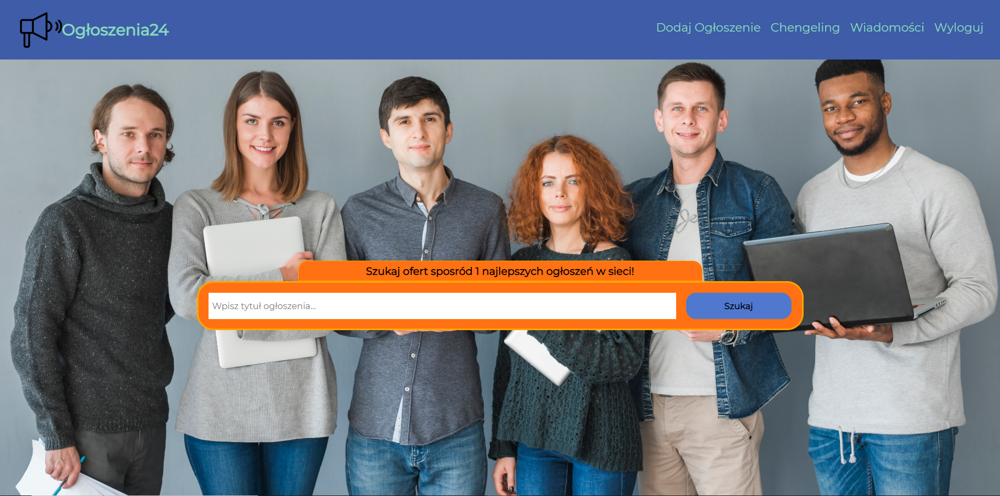
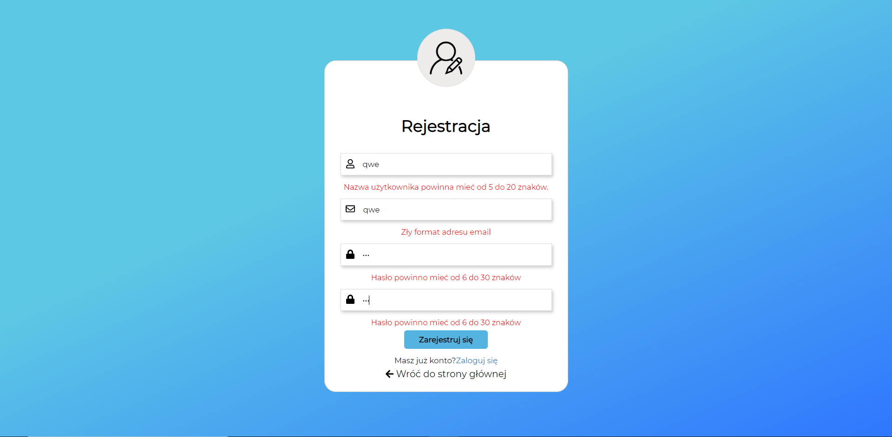
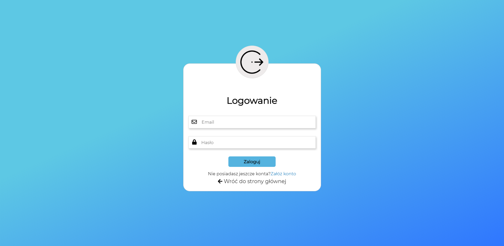
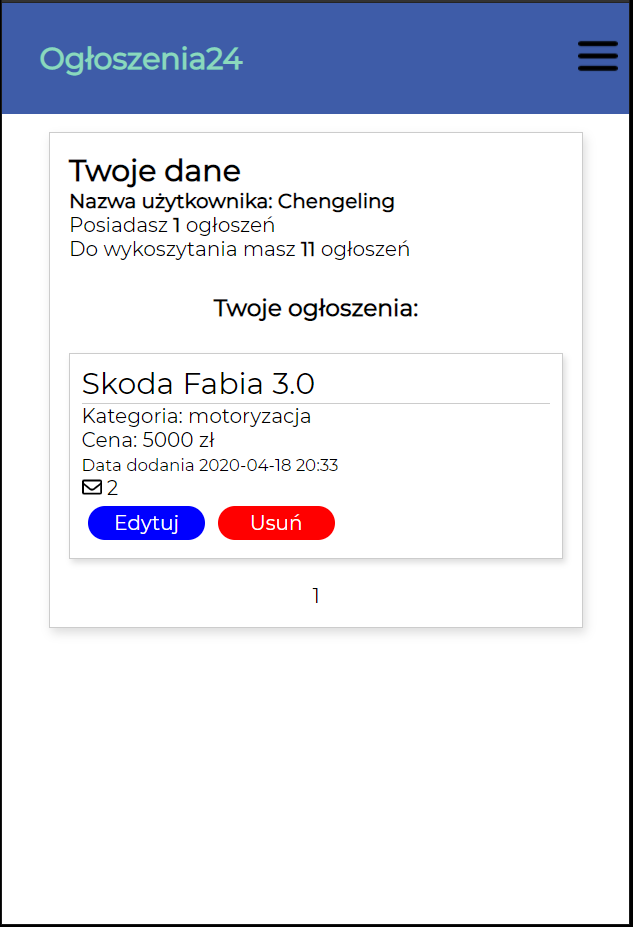

# Ogloszenia24 (ciągle w pracach)
Aplikacja ogłoszeniowa napisana w frameworku Flask. Umożliwia dodawanie, usuwanie, edycje ogłoszeń, wysyłanie wiadomości między użytkownikami, wyszukiwanie ogłoszeń

## Technologie 
* HTML5/CSS3/BEM/RWD
* Flask
* SQLAlchemy
* Sqlite3

## Wygląd

